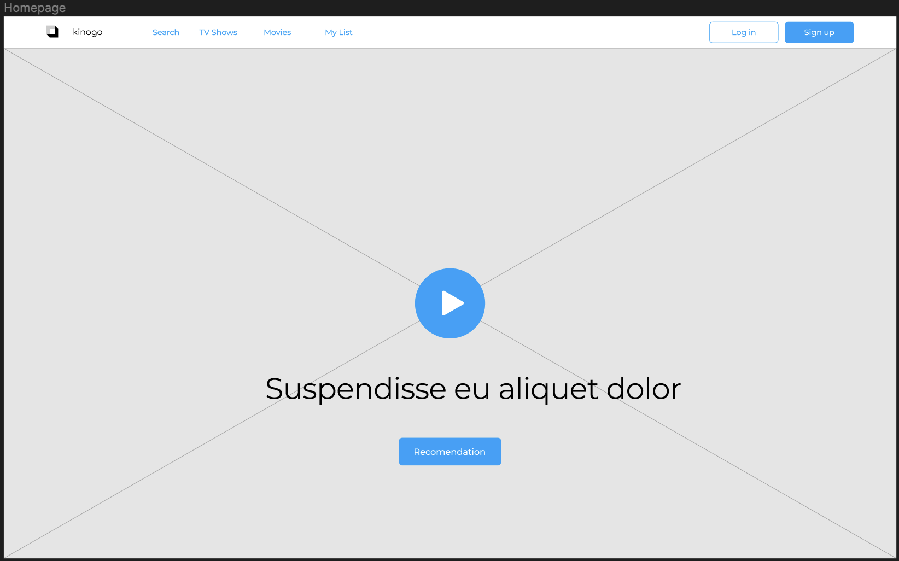
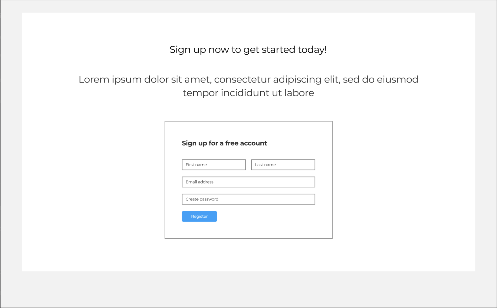
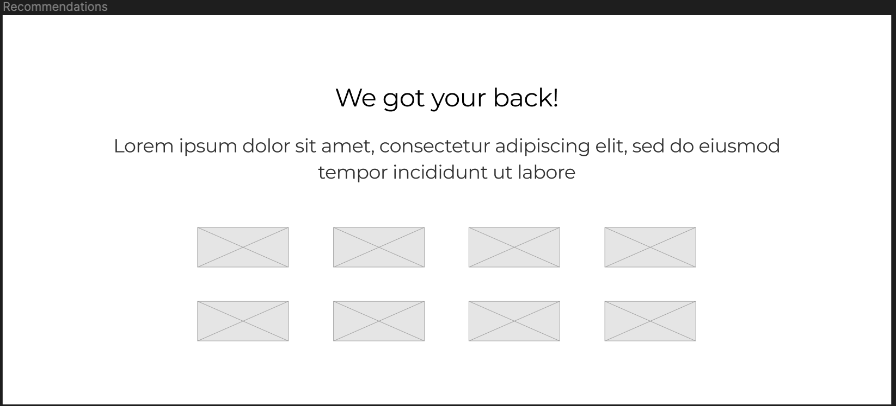

# Kinogo

## T3A2-A - Julia Ohannessian & David Oliverius

### Purpose

The modern streaming landscape often leaves users feeling lost and confused as to what to watch next. There is so much content to watch it is often paralysing, and it is hard to know what is worthwhile. **Kinogo** can help people find something worth watching fast, so you spend less time flicking and more time enjoying.

### Functionality/Features

- **User profiles**:

  - Secure login with Firebase
  - Profile page with display photo
  - Personal watchlist
  - Add friends
  - View friends profiles + watchlists

- **Movie + TV Show pages**:

  - Lookup any Movie or TV Show, page will be populated with data from TMDB API
  - Users can leave written reviews + rating out of 5 stars
  - Other users can 'like' reviews
  - If page has reviews, most liked reviews appear first
  - Direct user to where they can stream/buy/hire

- **Suggestion capability**:

  - Select genres, years, actors, director
  - Simple algorithm will suggest random titles
  - If interested, users can save to their watchlist

### Target Audience

The target audience is anyone who has an interest in Movies and Television - from cinephiles who have niche tastes, to casual viewers that want to know what everyone else is watching.

### Tech stack

**_Front-end:_**

- React
- HTML
- CSS
- JavaScript
- Material UI
- Axios
- Jest

**_Back-end:_**

- ExpressJS
- Node.js
- Firebase
- Mocha

**_Database:_**

- MongoDB

**_Deployment:_**

- Heroku
- Netlify

**_Project Management Tools:_**

- Trello
- Discord

**_Design Tools:_**

- Figma
- Adobe XD

**_DevOps Tools:_**

- Github
- Heroku

**_IDE:_**

- Visual Code Studio

### Dataflow Diagram

### Application Architecture Diagram

### User Stories

#### User personas

User Personas, alongside User Stories, are really useful in providing the direction for what features need to be built during the development process. As a part of the Agile methodology, these frameworks help guide and give a clear direction to the development team, based on the various end user’s needs. This is different to buildings features based on technical requirements which would ultimately lead to building a product that no one uses.

In order for us to help narrow down what features we were going to build for Kinogo, we decided to create two user personas that we felt represented a reasonable cross-section of our user base. While we didn’t have time to interview users one on one, we felt that these two personas provided us with enough of a foundation to create our user stories. We used a template described [here](https://www.hotjar.com/blog/user-personas/) as a basis for creating our User personas.

**Our Personas:**

---

_The Cinephile_

---

_Who are they?_

The Cinephile loves to be up to date with all the latest cinematic releases, whether they be the latest superhero action film to the most obscure Arthouse feature. They are passionate about films and even more passionate about critiquing them. They are also the go to person for film recommendations in their immediate circle.

_What is their main goal?_

Their main goal is to compile a list of the films they have seen as well as the critiques they’ve made about them.

_What’s the main barrier to achieving this goal?_

Having a centralised website that incorporates all the tools they need to compile their movie watchlist and reviews

---

_The Casual_

---

_Who are they?_

The Casual enjoys watching movies when they have the time. While they enjoy watching films, they are only aware of the latest releases when they see a billboard or an advertisement on television. While they don’t dissect films from back to front, they like to make sure that ones they do watch are worth watching.

_What is their main goal?_

To find the latest releases when they decide to go and watch a film.

_What’s the main barrier to achieving this goal?_

They don’t have a place that tells them what the latest films are.

### Wireframes for multiple standard screen sizes, created using industry-standard software

#### Desktop

#### Tablet

#### Phone

### Screenshots of your Trello board throughout the duration of the project

