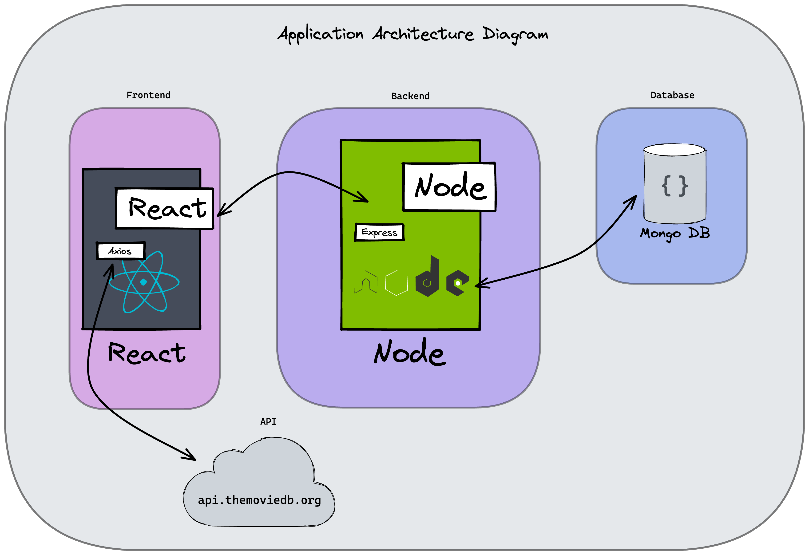
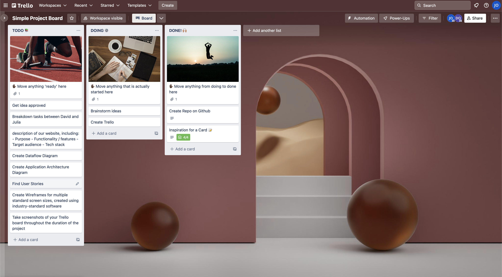
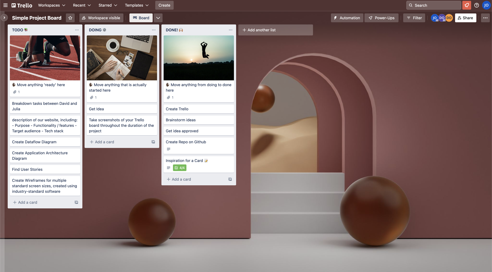
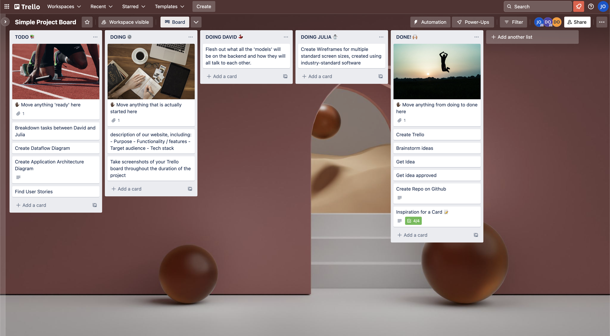
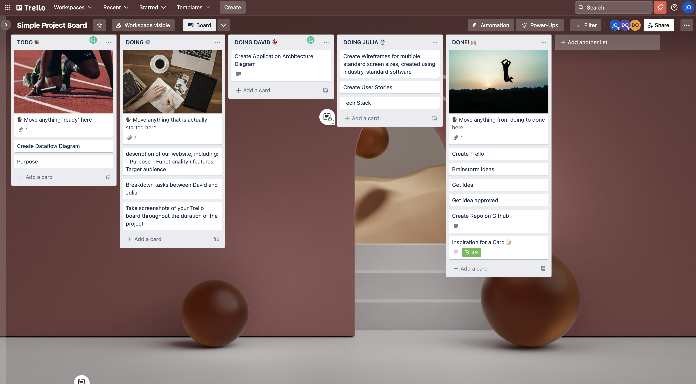

# Kinogo

### T3A2-A - Julia Ohannessian & David Oliverius

#### Purpose

<!-- Feel like you've watched everything, have searched through every streaming platform and channel, and still don't know what to watch? The app you need is called "What to Watch." (not the actual title) -->

The modern streaming landscape often leave users feeling lost and confused as to what to watch next. There is so much content to watch it is often paralysing, and it is hard to know what is worthwhile. **Kinogo** can help people find something worth watching fast, so you spend less time flicking and more time enjoying.

#### Functionality/Features

- **User profiles**:

  - Secure login with Firebase
  - Profile page with display photo
  - Personal watchlist
  - Add friends
  - View friends profiles + watchlists

- **Movie + TV Show pages**:

  - Lookup any Movie or TV Show, page will be populated with data from TMDB API
  - Users can leave written reviews + rating out of 5 stars
  - Other users can 'like' reviews
  - If page has reviews, most liked reviews appear first
  - Direct user to where they can stream/buy/hire

- **Suggestion capability**:

  - Select genres, years, actors, director
  - Simple algorithm will suggest random titles
  - If interested, users can save to their watchlist

#### Target Audience

The target audience is anyone who has an interest in Movies and Television - from cinephiles who have niche tastes, to casual viewers that want to know what everyone else is watching.

#### Tech stack

**_Front-end:_**

- React
- HTML
- CSS
- JavaScript
- Material UI
- Axios
- Jest

**_Back-end:_**

- ExpressJS
- Node.js
- Firebase
- Mocha

**_Database:_**

- MongoDB

**_Deployment:_**

- Heroku
- Netlify

**_Project Management Tools:_**

- Trello
- Discord

**_Design Tools:_**

- Figma
- Adobe XD

**_DevOps Tools:_**

- Github
- Heroku

**_IDE:_**

- Visual Code Studio

#### Dataflow Diagram

#### Application Architecture Diagram

#### User Stories

#### Wireframes for multiple standard screen sizes, created using industry-standard software

#### Screenshots of your Trello board throughout the duration of the project

