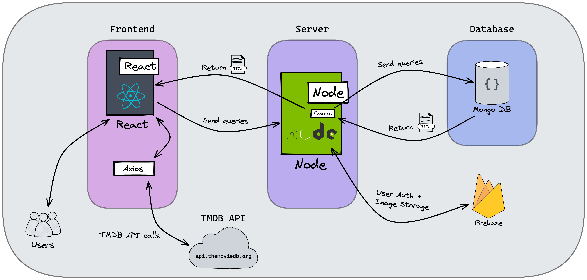

# T3A2-A---Full-Stack-App-Part-A-

#### Purpose

Feel like you've watched everything, have searched through every streaming platform and channel, and still don't know what to watch? The app you need is called "What to Watch." (not the actual title)

#### Functionality/features

- Profiles for users
- Allowing users to post reviews for movies
- Add friends
- See other users' reviews
- See their friend's watchlists
- Users can select a variety of filters (genre, year, actor)
- Random movies will be suggested
- Movies that are appealing can be ‘liked’ and stored on a watchlist for the user
- Another feature is letting the user know where they can stream/buy/hire the movie or tv show

#### Target audience

#### Tech stack

**_Front-end:_**

- REACT.JS
- HTML
- CSS
- JavaScript
- Material UI

**_Back-end:_**

- ExpressJS
- Node.js
- Firebase

**_Database:_**

- MongoDB

**_Front-end testing:_**

- Jest

**_Back-end testing:_**

- Mocha

**_Back-end deployment:_**

- Heroku

**_Front-end Deployment:_**

- Netlify

**_Project Management Tools:_**

- Trello
- Discord

**_Design Tools:_**

- Figma
- AdobeXD

**_DevOps Tools:_**

- Github
- Heroku

**_IDE:_**

- Visual Code Studio

#### Dataflow Diagram

#### Application Architecture Diagram

#### User Stories

#### Wireframes for multiple standard screen sizes, created using industry-standard software

#### Screenshots of your Trello board throughout the duration of the project

